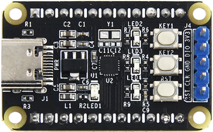

## PY32F002B

PY32F002B系列微控制器采用高性能的 32 位ARM® Cortex®-M0+内核，宽电压工作范围的MCU。嵌入24 Kbytes Flash和3 Kbytes SRAM存储器，最高工作频率24 MHz。包含多种不同封装类型产品。芯片集成I2C、SPI、USART等通讯外设，1路12位 ADC，2个16位定时器，以及2路比较器 PY32F002B 系列微控制器的工作温度范围为-40°C ~ 85°C，工作电压范围 1.7 V ~ 5.5 V。芯片提供sleep/stop低功耗工作模式，可以满足不同的低功耗应用。 PY32F002B 系列微控制器适用于多种应用场景，例如控制器、手持设备、PC外设、游戏和GPS平台、工业应用等。

## 产品特性
- 32 位 ARM® Cortex®-M0+内核，最高工作频率 24 MHz
- 24 Kbytes Flash，3 Kbytes SRAM
- 12 位 ADC，2 路比较器
- 1 个 16 位高级定时器，1 个 16 位通用定时器以及 1 个 16 位LPTIM
- 1 个 32 位滴答定时器
- 1 个 I2C 接口，1 个 SPI 接口，1 个 USART 接口
- 1 个 SWD 接口
- 2 个用户按键和 1 个复位按键
- Typec 接口供电

## 产品图片

